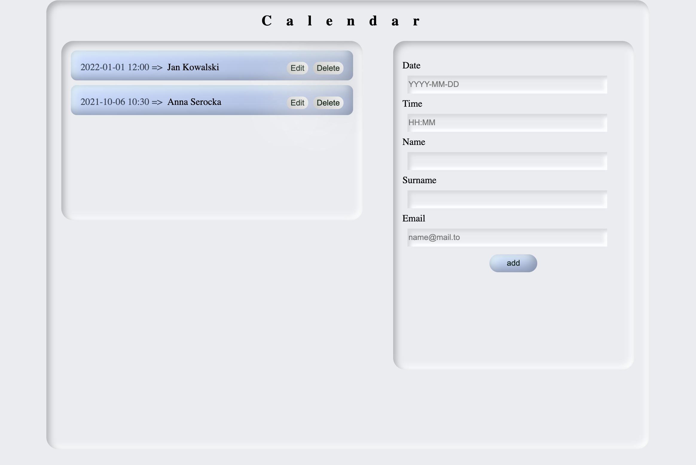

# devmentor.pl - React: Redux basics / Calendar

## Table of contents

-   [Overview](#overview)
    -   [The challenge](#the-challenge)
    -   [Screenshot](#screenshot)
    -   [How to run the project](#how-to-run-the-project)
-   [My process](#my-process)
    -   [Built with](#built-with)
    -   [What I learned](#what-i-learned)
    -   [Continued development](#continued-development)
    -   [Useful resources](#useful-resources)
-   [Author](#author)
-   [Acknowledgments](#acknowledgments)

## Overview

### The challenge

The challenge was to re-write an application with React state management to Redux pattern and to style it with styled-components.

### Screenshot

### How to open project

1. Clone git repository and open file on your local device in Code editor.
2. Run `npm install` command to install all npm packages.
3. Run `json-server --watch ./db/data.json --port 300` command to run local API.
4. Run `npm start` command to open developer mode.

Localhost port: `http://localhost:3005/meetings`

## My process

In the beginning, I created the Store in `store.js`, simple Reducer in `calendarReducer.js`, and Provider in my `index.js` to pass store to other components. I had to check what actions `Calendar.js` is covering and created two actions based on that knowledge: `loadMeetingsAction` and `saveMeetingAction` in `actions/calendar.js`. The next step was to modify Reducer to serve those actions. Because the app was written in class components I connected React with Redux by mapping state and action to props (mapStateToProps and mapActionToProps). When I finished and Redux state management was working correctly I decided to re-write class components to functional components and use React Hooks. I moved API calls into a separate file (`providers/calendarProvider.js`) and use thunk middleware to make API calls work with Redux and handle the dispatching. In the end, I decided to add `edit` and `delete` buttons as an extra feature to my project.

### Built with

-   React
-   React Hooks and custom Hooks
-   Redux
-   Thunk middleware for Redux
-   Javascript
-   Styled Components
-   Webpack

### What I learned

By doing this challenge I learned how to use React-Redux, especially how to create actions and dispatch them. I learned how to approach class and functional components with Redux pattern and how to use thunk middleware. I had a chance to work more with React Hooks and to style my components with the styled-components technique.

### Continued development

### Useful resources

-   [Redux course: basics](https://fullstak.pl/Kurs-Podstawy-Redux/) - Basic Redux course in polish language by Artur Chmaro.
-   [Redux book](https://read.reduxbook.com/)
-   [Redux.js.org](https://redux.js.org/) - Documentation for Redux.
-   [Redux Thunk](https://github.com/reduxjs/redux-thunk) - Documentation for Redux Thunk middleware.
-   [Neumorphism.io](https://neumorphism.io/) - Generator for Soft-UI CSS code

## Author

-   Frontend Mentor - [@Axseinga](https://www.frontendmentor.io/profile/yourusername)
-   LinkedIn - [Agnieszka Urbanowicz](https://www.linkedin.com/in/agnieszka-urbanowicz-051147151/)

## Acknowledgments

Thanks to my [Mentor - devmentor.pl](https://devmentor.pl/) - for providing me with this task and for code review.
